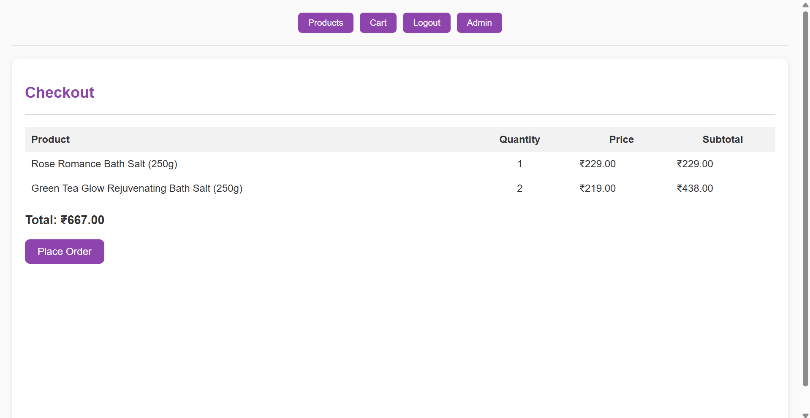

# 🛁 SerenSoak – Herbal Bath Salts E-Commerce Website

SerenSoak is a modern, elegant, and secure e-commerce platform focused on selling **Handcrafted Herbal Bath Salts**. Built using **Django** for the backend and **HTML/CSS/JavaScript** for the frontend, SerenSoak offers a seamless and login-gated shopping experience for self-care enthusiasts.

🌿 **Live Demo**: [Visit Now](https://serensoak.onrender.com/)

🔗 **GitHub Repository**: [SerenSoak GitHub](https://github.com/Shifani-golda/CodeAlpha_E-commerce-Store.git)

---

## 💡 About the Project

**SerenSoak** is a mini e-commerce website tailored for a niche market—herbal and luxury bath salts. It was developed as part of my internship project with the goal of showcasing both frontend design and backend development skills in a full-stack Django application.

Key highlights include:
- Professional user interface
- Login-restricted access to product listings and cart
- Secure cart and checkout experience
- Herbal wellness theme for product appeal

---

## ✨ Features

### ✅ General
- Responsive UI for both desktop and mobile
- Stylish product pages with high-quality descriptions and benefits
- Custom branding and layout (SerenSoak theme)

### 🔐 User Authentication
- User Registration & Login
- Only logged-in users can:
  - View products
  - Access shopping cart
  - Place orders

### 🛍️ Product System
- 12 handcrafted **Herbal Bath Salt** products
- Each product includes:
  - Name
  - Price
  - Image
  - Ingredients
  - Benefits
  - Description

### 🛒 Shopping Cart
- Add to Cart, Update Quantity, Remove Items
- Only logged-in users can access and manage their cart

### 📦 Order Processing *(Optional for future updates)*
- Checkout system (can be integrated with payment gateways like Razorpay/Stripe)

---

## 🖼️ Product Showcase

Here are a few examples of the featured products:

- 🌸 **Lavender Serenity Bath Salt** – Calming soak for stress relief  
- 🌿 **Eucalyptus Fresh Relief Bath Salt** – Energizing bath with mint & eucalyptus  
- 🍊 **Citrus Burst Energizing Bath Salt** – Revitalizes and detoxifies skin  

> ✨ All products are presented with visually appealing cards using CSS & custom design elements.

---

## 🔒 Authentication System

- 🚪 Login required to view **Product Listings** and **Shopping Cart**
- 🚫 Anonymous users are redirected to login/signup page
- 🔐 Secured with Django’s built-in auth system

---

## 🛠️ Tech Stack

| Layer       | Technology               |
|-------------|---------------------------|
| Backend     | Django (Python)           |
| Frontend    | HTML, CSS, JavaScript     |
| Database    | SQLite (default Django DB)|
| Deployment  | GitHub + Render / PythonAnywhere (user-deployed) |
| Versioning  | Git & GitHub              |

---

## ⚙️ Installation & Setup

> 💻 Clone the repository and set it up locally:

```bash
git clone https://github.com/Shifani-golda/CodeAlpha_E-commerce-Store.git
cd CodeAlpha_E-commerce-Store
python -m venv venv
source venv/bin/activate  # or venv\Scripts\activate on Windows
pip install -r requirements.txt
python manage.py migrate
python manage.py runserver
```

Create a superuser to access Django Admin:
  
       python manage.py createsuperuser


## 📸 Screenshots  

### 🔐 **Login Page**
  

### **Register Page**
  

### ✨ **Welcome Page**
   
   

### 🛍️ **Product Listing (after login)**
  

### 🧂 **Category Listing**
  
  

### 🖼️ **Individual Product Detail**
  
  


### 🛒 **Cart Page**
   
  

### **Checkout Page**
  

### 📦 **Order Placement**
  

---

## 🧠 What I Learned

Through SerenSoak, I gained hands-on experience in:

- Building secure user login systems in Django  
- Creating dynamic product-based views and restricting access  
- Designing a frontend that matches a theme (herbal wellness)  
- Managing GitHub repositories and deploying web apps  

---

## 📬 Feedback

If you have any suggestions or feedback, feel free to connect with me:

📧 Email: shifanigolda@karunya.edu.in  
💼 LinkedIn: [www.linkedin.com/in/shifani-golda-062028363](www.linkedin.com/in/shifani-golda-062028363)

> ⭐ If you found this project interesting or useful, give it a star on GitHub!
